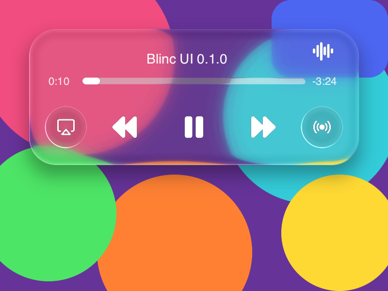

# Blinc

[](https://github.com/project-blinc/Blinc/actions/workflows/ci.yml)
[](https://github.com/project-blinc/Blinc/actions/workflows/ci.yml)
[](https://www.rust-lang.org)
[](https://crates.io/crates/blinc)
[](LICENSE)




**Native UI Framework powered by Zyntax** - A declarative, reactive UI system with first-class state machines, spring physics animations, and GPU-accelerated rendering.

## Installation

### Quick Install (macOS/Linux)

```bash
curl -fsSL https://raw.githubusercontent.com/project-blinc/Blinc/main/scripts/install.sh | bash
```

### Manual Installation

Download the appropriate binary from [Releases](https://github.com/project-blinc/Blinc/releases):

| Platform              | Download                                 |
| --------------------- | ---------------------------------------- |
| macOS (Apple Silicon) | `blinc-aarch64-apple-darwin.tar.gz`      |
| macOS (Intel)         | `blinc-x86_64-apple-darwin.tar.gz`       |
| Linux (x86_64)        | `blinc-x86_64-unknown-linux-gnu.tar.gz`  |
| Linux (ARM64)         | `blinc-aarch64-unknown-linux-gnu.tar.gz` |
| Windows               | `blinc-x86_64-pc-windows-msvc.zip`       |

### Build from Source

```bash
git clone https://github.com/project-blinc/Blinc
cd blinc
cargo install --path crates/blinc_cli
```

### Verify Installation

```bash
blinc doctor
```

## Overview

Blinc is a next-generation UI framework that combines:

- **Declarative DSL** (`.blinc` / `.bl`) - Compile-time optimized widget definitions
- **Fine-grained Reactivity** - Signal-based state without VDOM overhead
- **Built-in State Machines** - Harel statecharts for complex widget interactions
- **Animation-first Design** - Keyframes + spring physics rivaling Framer Motion
- **GPU Rendering** - SDF-based primitives via wgpu/Metal
- **Paint/Canvas System** - Full 2D drawing API for custom graphics
- **Cross-platform** - Android, iOS, Desktop (macOS, Windows, Linux)

## Architecture

```text
┌─────────────────────────────────────────────────────────────────────┐
│                         Blinc Application                           │
├─────────────────────────────────────────────────────────────────────┤
│  .blinc/.bl Source Files                                            │
│  ├── Widgets (@widget, @render)                                     │
│  ├── State (@state, @derived)                                       │
│  ├── Machines (@machine)                                            │
│  └── Animations (@animation, @spring)                               │
├─────────────────────────────────────────────────────────────────────┤
│                    Zyntax Compilation Pipeline                       │
│  ┌──────────┐   ┌──────────┐   ┌──────────┐   ┌──────────────────┐ │
│  │ blinc.zyn│ → │ TypedAST │ → │   HIR    │ → │ JIT (dev) / AOT  │ │
│  │ Grammar  │   │          │   │          │   │ (production)     │ │
│  └──────────┘   └──────────┘   └──────────┘   └──────────────────┘ │
├─────────────────────────────────────────────────────────────────────┤
│                     ZRTL Runtime Extensions                          │
│  ┌────────────┐ ┌────────────┐ ┌────────────┐ ┌────────────────────┐│
│  │ blinc_core │ │ blinc_anim │ │ blinc_gpu  │ │ blinc_platform_*  ││
│  │ (signals,  │ │ (springs,  │ │ (wgpu,     │ │ (android, ios,    ││
│  │  fsm)      │ │  keyframes)│ │  paint)    │ │  desktop)         ││
│  └────────────┘ └────────────┘ └────────────┘ └────────────────────┘│
└─────────────────────────────────────────────────────────────────────┘
```

## Toolchain

### Development (JIT + Hot Reload)

```bash
# Run with hot-reload (Zyntax JIT)
blinc dev app.blinc --target desktop

# Mobile development with live preview
blinc dev app.blinc --target android --device emulator
```

### Production (AOT)

```bash
# Build optimized native binary
blinc build app.blinc --target macos --release

# Build for mobile
blinc build app.blinc --target android --release
blinc build app.blinc --target ios --release

# Cross-compile
blinc build app.blinc --target windows --cross
```

### Plugin Compilation

```bash
# Build ZRTL plugin (dynamic library)
blinc plugin build extensions/my_plugin --mode dynamic

# Build static plugin (for AOT embedding)
blinc plugin build extensions/my_plugin --mode static
```

## Example

```blinc
@widget Counter {
    @state count: Int = 0

    @spring scale {
        stiffness: 400
        damping: 25
        target: 1.0
    }

    @machine button_fsm {
        initial: idle

        states {
            idle {
                on POINTER_DOWN => pressed
            }
            pressed {
                entry: { scale.animate_to(0.95) }
                exit: { scale.animate_to(1.0) }
                on POINTER_UP => idle {
                    actions: [increment_count]
                }
            }
        }

        actions {
            increment_count: () => count.set(count.get() + 1)
        }
    }

    @render {
        Container(
            padding: 16.px,
            transform: Transform::scale(scale.value),
        ) {
            Text(content: "Count: {count}")

            Button(label: "Increment") {
                on_click: () => count.set(count.get() + 1)
            }
        }
    }
}
```

## Paint/Canvas System

Blinc includes a full Paint/Canvas API for custom drawing:

```blinc
@widget CustomChart {
    @state data: List<f32> = []

    @render {
        Canvas(width: 400.px, height: 300.px) {
            @paint (ctx) {
                // Background
                ctx.fill_rect(0, 0, 400, 300, Color::white())

                // Draw chart
                ctx.begin_path()
                ctx.move_to(0, 300 - data[0] * 3)
                for (i, value) in data.enumerate() {
                    ctx.line_to(i * 10, 300 - value * 3)
                }
                ctx.stroke(Color::blue(), 2.0)

                // Custom shapes with SDF
                ctx.draw_sdf(
                    sdf: SDF::rounded_rect(100, 50, 8),
                    position: Point(150, 125),
                    fill: Gradient::linear(Color::red(), Color::orange())
                )
            }
        }
    }
}
```

## License

Apache License 2.0 - see [LICENSE](LICENSE)
