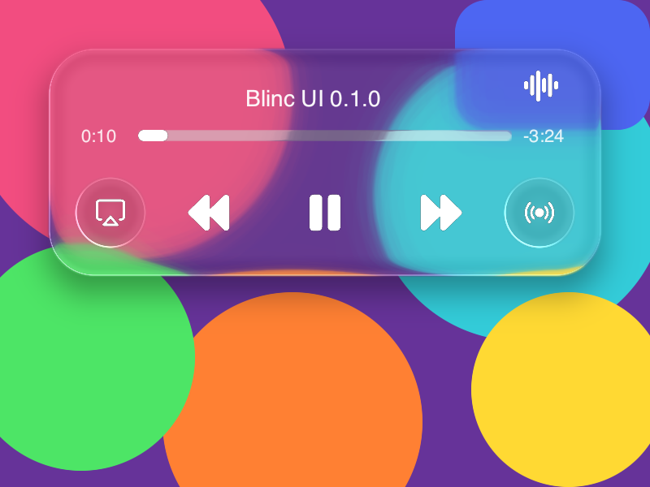

# Blinc

[](https://github.com/project-blinc/Blinc/actions/workflows/ci.yml)
[](https://www.rust-lang.org)
[](https://doc.rust-lang.org/edition-guide/rust-2024/)
[](https://crates.io/crates/blinc_app)
[](LICENSE)
[](https://project-blinc.github.io/Blinc)
[](https://project-blinc.github.io/Blinc/web/example-gallery.html)
[](https://discord.gg/WXADUBBgzP)



**A GPU-accelerated, cross-platform UI framework** for building desktop, mobile, and web applications from a single Rust codebase.

## Highlights

- **GPU-Accelerated**: SDF rendering, glassmorphism, spring physics, @flow custom shaders
- **Cross-Platform**: Desktop (macOS/Windows/Linux), Android, iOS, Web (WebGPU)
- **Builder API**: Declarative, chainable: `div().flex_col().gap(16.0).child(text("Hello"))`
- **40+ Components**: shadcn/ui-style library with CSS-overridable theming
- **40+ Live Demos**: [Try them in your browser](https://project-blinc.github.io/Blinc/web/example-gallery.html) (WebGPU required)

## Quick Start

```rust
use blinc_app::prelude::*;
use blinc_app::windowed::WindowedApp;

fn main() -> Result<()> {
    WindowedApp::run(WindowConfig::default(), |ctx| {
        div()
            .w(ctx.width).h(ctx.height)
            .bg(Color::rgb(0.1, 0.1, 0.15))
            .justify_center().items_center()
            .child(text("Hello Blinc!").size(48.0).color(Color::WHITE))
    })
}
```

The same `build_ui` function runs on desktop and web and no separate codebase.

## Running the examples

A fresh clone builds every example with no extra setup — the sibling crates
(`blinc_canvas_kit`, `blinc_portal_ui`, `blinc_node_editor`, `blinc_game_kit`)
resolve from their published git pins:

```bash
cargo run -p blinc_app_examples --example cn_demo --features cn
```

### Developing the sibling crates

Those four crates live in their own repositories. To edit them from local
checkouts, opt in with:

```bash
./scripts/use-local-packages.sh   # clones them into packages/ (gitignored)
                                  # and redirects the workspace to those copies
```

This modifies `Cargo.toml` **locally only** — do not commit it (CI's
`check-no-local-patch.sh` guard rejects it). Revert before committing:

```bash
./scripts/use-published-packages.sh
```

### Building on low-resource machines

The debug profile is tuned so a workspace build fits comfortably on ~8 GB
RAM / a small SSD: dependencies are compiled without debuginfo and
workspace crates use line-table backtraces only (`file:line` still
resolves). That is the single biggest lever for both `target/` size and
peak linker memory — no configuration needed.

If a full-workspace build still thrashes or OOMs on a constrained box
(e.g. an 8 GB ASUS NUC), reach for these, in order of impact:

- **Build only what you need**, not the whole workspace:
  `cargo run -p blinc_app_examples --example cn_demo --features cn`.
- **Cap parallelism** so N `rustc` processes don't collectively exhaust
  RAM: `CARGO_BUILD_JOBS=4 cargo build` (or uncomment `jobs` in
  `.cargo/config.toml`). Start near half your core count.
- **Use a faster, lower-memory linker** (mold on Linux, lld on macOS) —
  see the commented target blocks in `.cargo/config.toml`. Linking is the
  heaviest single step on low-RAM machines.
- **Reclaim SSD** with `CARGO_INCREMENTAL=0` (smaller `target/`, slower
  warm rebuilds), and `cargo clean` between large feature switches.

## Platform Support

| Platform | Status | Backend |
|----------|--------|---------|
| macOS | Stable | wgpu (Metal) |
| Windows | Stable | wgpu (DX12/Vulkan) |
| Linux | Stable | wgpu (Vulkan) |
| Android | Stable | wgpu (Vulkan) |
| iOS | Stable | wgpu (Metal) |
| **Web (WASM)** | **Preview** | wgpu (WebGPU) — Chrome 113+, Edge 113+, Firefox 141+, Safari 18+ (macOS Tahoe) |
| HarmonyOS | In progress | wgpu (Vulkan/OpenGL ES) |

## Documentation

**[Blinc Book](https://project-blinc.github.io/Blinc)**: comprehensive guide covering layout, styling, animation, widgets, routing, media, and more.

**[Live Example Gallery](https://project-blinc.github.io/Blinc/web/example-gallery.html)**: 40+ interactive WebGPU demos running in your browser.

**[API Reference](https://docs.rs/blinc_app)**: rustdoc for all crates.

**[Skills.md](Skills.md)**: concise, example-driven reference for AI code agents.

## Crates

| | Crate | Description |
|-|-------|-------------|
| **Core** | [blinc_app](crates/blinc_app) | App framework, windowed + web runners |
| | [blinc_core](crates/blinc_core) | Signals, state machines, types |
| | [blinc_layout](crates/blinc_layout) | Flexbox layout, element builders, widgets |
| | [blinc_gpu](crates/blinc_gpu) | SDF rendering, glass, shaders |
| **Rendering** | [blinc_text](crates/blinc_text) | Text shaping, glyph atlas |
| | [blinc_svg](crates/blinc_svg) | SVG parsing + rasterization |
| | [blinc_image](crates/blinc_image) | Image decoding, lazy loading |
| | [blinc_paint](crates/blinc_paint) | Canvas/paint API |
| **Animation** | [blinc_animation](crates/blinc_animation) | Springs, keyframes, timelines |
| | [blinc_theme](crates/blinc_theme) | Design tokens, light/dark mode |
| **Components** | [blinc_cn](crates/blinc_cn) | 40+ shadcn/ui-style components |
| | [blinc_icons](crates/blinc_icons) | Lucide icon set |
| **Platform** | [blinc_platform](crates/blinc_platform) | Cross-platform traits |
| | [blinc_platform_desktop](extensions/blinc_platform_desktop) | Desktop (winit) |
| | [blinc_platform_android](extensions/blinc_platform_android) | Android (NDK) |
| | [blinc_platform_ios](extensions/blinc_platform_ios) | iOS (UIKit/Metal) |
| | [blinc_platform_web](extensions/blinc_platform_web) | Web (WebGPU/WASM) |

## Roadmap

Current focus:

1. Missing widgets (date/time/color picker, data grid)
2. Zyntax DSL: `.blinc` domain specific language for UI definitions, with support for live editing and hot reload in the future
3. Accessibility (screen reader, keyboard navigation)
4. Developer tooling (hot reload, visual inspector)

Planned work is tracked as issues in the repository itself, with
[git-bug](https://github.com/git-bug/git-bug): `git-bug bug --status open`
after a `git-bug pull bugs`.

## Community

Join us on **[Discord](https://discord.gg/WXADUBBgzP)**: questions, showcases, design discussion, and roadmap chatter. Also feel free to open a [GitHub Discussion](https://github.com/project-blinc/Blinc/discussions) for longer-form conversations.

## License

Apache License 2.0 - see [LICENSE](LICENSE)
